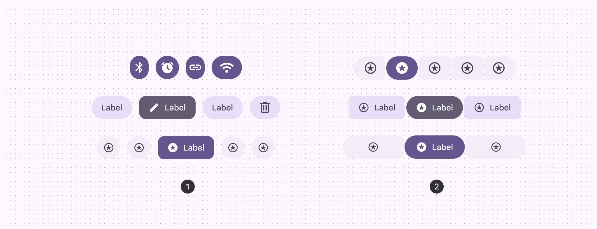
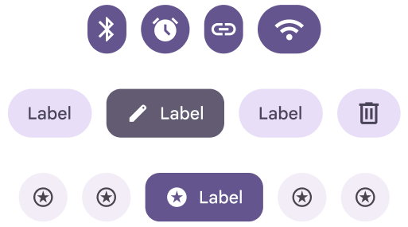

<!--docs:
title: "Button groups"
layout: detail
section: components
excerpt: "A customizable button component with updated visual styles."
iconId: materialbutton
path: /catalog/buttons/
-->

# Button groups

[Button groups](https://m3.material.io/components/button-groups/overview)
organize buttons and add interactions between them.There are two variants of a
button group.



1.  Standard button group
2.  Connected button group

**Note:** Images use various dynamic color schemes.

## Design & API documentation

*   [Material 3 (M3) spec](https://m3.material.io/components/button-groups/overview)
*   [API reference](https://developer.android.com/reference/com/google/android/material/button/package-summary)

## Anatomy

Button groups are invisible containers that add padding between buttons and
modify button shape. They don’t contain any buttons by default.


1.  Container

More details on anatomy items in the
[component guidelines](https://m3.material.io/components/button-groups/guidelines#8fcef838-b0f2-4663-9df5-a8c140822fa6).

## M3 Expressive

### M3 Expressive update

Before you can use `Material3Expressive` component styles, follow the
[`Material3Expressive` themes setup instructions](https://github.com/material-components/material-components-android/tree/master/docs/getting-started.md#material3expressive-themes).


Button groups apply shape, motion, and width changes to buttons and icon buttons
to make them more interactive.
[More on M3 Expressive](https://m3.material.io/blog/building-with-m3-expressive)

Button groups are new components added in Expressive.

**Types and naming:**

*   Added standard button group
*   Added connected button group
    *   Use instead of segmented button, which is deprecated

**Configurations:**

*   Works with all button sizes: XS, S, M, L, and XL
*   Applies default shape to all buttons: round or square

### M3 Expressive styles

Default styles in the expressive themes:

-   Standard button group:
    `Widget.Material3Expressive.MaterialButtonGroup`
-   Connected button group:
    `Widget.Material3Expressive.MaterialButtonGroup.Connected`

## Key properties

### Shape and size attributes

Element                         | Attribute                | Related method(s)                            | Default value
------------------------------- | ------------------------ | -------------------------------------------- | -------------
**Group shape (outer corners)** | `app:shapeAppearance`    | `setShapeAppearance`<br>`getShapeAppearance` | `none`
**Size of inner corners**       | `app:innerCornerSize`    | `setInnerCornerSize`<br>`getInnerCornerSize` | `none`
**Spacing between buttons**     | `android:spacing`        | `setSpacing`<br>`getSpacing`                 | `12dp`
**Child size change**           | `app:childSizeChange`    | N/A                                          | `15%` in pressed,<br>otherwise, `0%`
**Child overflow mode**         | `app:overflowMode`       | `setOverflowMode`<br>`getOverflowMode`       | `none`
**Overflow button icon**        | `app:overflowButtonIcon` | `setOverflowButtonIcon`                      | `abc_ic_menu_overflow_material` (3 dots)

### Additional attributes of child buttons

Element                             | Attribute                | Related method(s) | Default value
----------------------------------- | -------------------------| ----------------- | -------------
**Title of the overflow menu item** | `app:layout_overflowText`| N/A               | button's `text` value, if not specified or empty
**Icon of the  overflow menu item** | `app:layout_overflowIcon`| N/A               | `null`

### Styles and theme attributes

Element                        | Style                                  | Theme Attribute
------------------------------ | -------------------------------------- | ---------------
**Default style**              | `Widget.Material3.MaterialButtonGroup` | `?attr/materialButtonGroupStyle`
**Overflow icon button style** | `?attr/materialIconButtonStyle`        | `?attr/materialButtonGroupOverflowButtonStyle`
**Overflow menu style**        | `?attr/popupMenuStyle`                 | `?attr/materialButtonGroupOverflowPopupMenuStyle`

## Variants of button groups

<details>

<summary><h3>Standard button group</h3></summary>

The standard button group contains multiple related individual buttons. The
individual button's shape is preserved.



#### Button group examples

Source code:

*   `MaterialButtonGroup`
    *   [Class source](https://github.com/material-components/material-components-android/tree/master/lib/java/com/google/android/material/button/MaterialButtonGroup.java)
*   `MaterialButton`
    *   [Class source](https://github.com/material-components/material-components-android/tree/master/lib/java/com/google/android/material/button/MaterialButton.java)

The following example shows a button group with three buttons that have text
labels.

In the layout:

```xml
<com.google.android.material.button.MaterialButtonGroup
    android:id="@+id/buttonGroup"
    android:layout_width="wrap_content"
    android:layout_height="wrap_content">
    <Button
        android:id="@+id/button1"
        android:layout_width="wrap_content"
        android:layout_height="wrap_content"
        android:text="Button 1"
    />
    <Button
        android:id="@+id/button2"
        android:layout_width="wrap_content"
        android:layout_height="wrap_content"
        android:text="Button 2"
    />
    <Button
        android:id="@+id/button3"
        android:layout_width="wrap_content"
        android:layout_height="wrap_content"
        android:text="Button 3"
    />
</com.google.android.material.button.MaterialButtonGroup>
```

</details>

<details>

<summary><h3>Connected button group</h3></summary>

In addition to standard button groups, connected button group also overrides the
individual button's shape to make them visually more belong to a group with 2dp
spacing, 8dp inner corners, and fully rounded outer corners.


#### Connected button group examples

Source code:

*   `MaterialButtonGroup`
    *   [Class source](https://github.com/material-components/material-components-android/tree/master/lib/java/com/google/android/material/button/MaterialButtonGroup.java)
*   `MaterialButton`
    *   [Class source](https://github.com/material-components/material-components-android/tree/master/lib/java/com/google/android/material/button/MaterialButton.java)

The following example shows a connected button group with three buttons that
have text labels. To correctly style a button group as connected button group,
the specific style needs to be set.

In the layout:

```xml
<com.google.android.material.button.MaterialButtonGroup
    android:id="@+id/buttonGroup"
    style="@style/Widget.Material3.MaterialButtonGroup.Connected"
    android:layout_width="wrap_content"
    android:layout_height="wrap_content">
    <Button
        style="?attr/materialButtonOutlinedStyle"
        android:id="@+id/button1"
        android:layout_width="wrap_content"
        android:layout_height="wrap_content"
        android:text="Button 1" />
    <Button
        style="?attr/materialButtonOutlinedStyle"
        android:id="@+id/button2"
        android:layout_width="wrap_content"
        android:layout_height="wrap_content"
        android:text="Button 2" />
    <Button
        style="?attr/materialButtonOutlinedStyle"
        android:id="@+id/button3"
        android:layout_width="wrap_content"
        android:layout_height="wrap_content"
        android:text="Button 3" />
</com.google.android.material.button.MaterialButtonGroup>
```

</details>

## Code implementation

Before you can use Material button groups, you need to add a dependency to the
Material components for Android library. For more information, go to the
[Getting started](https://github.com/material-components/material-components-android/tree/master/docs/getting-started.md)
page.

**Note:** `<Button>` is auto-inflated as
`<com.google.android.material.button.MaterialButton>` via
`MaterialComponentsViewInflater` when using a `Theme.Material3.*` theme.

### Making button groups adaptive

`MaterialButtonGroup` inherits from the `LinearLayout`. It can be configured to
achieve different child arrangements for different screen sizes or foldable
screens by using `layout_width` and `layout_weight`.

<details>

<summary><h4>Fixed button sizes</h4></summary>

When child buttons should not be adjusted while screen size changes, consider
using `layout_width` on all buttons.


```xml
<com.google.android.material.button.MaterialButtonGroup
    android:layout_width="match_parent"
    android:layout_height="wrap_content"
    android:paddingBottom="8dp"
    android:gravity="center_horizontal"
    android:spacing="4dp">
    <Button
        style="?attr/materialIconButtonFilledStyle"
        android:layout_width="wrap_content"
        android:layout_height="wrap_content"
        android:contentDescription="@string/cat_button_previous_icon"
        android:gravity="center"
        app:iconGravity="textStart"
        app:icon="@drawable/cat_button_previous_icon"/>
    <Button
        style="?attr/materialIconButtonFilledStyle"
        android:layout_width="wrap_content"
        android:layout_height="wrap_content"
        android:contentDescription="@string/cat_button_play_icon"
        android:gravity="center"
        app:iconGravity="textStart"
        app:icon="@drawable/cat_button_play_icon"/>
    <Button
        style="?attr/materialIconButtonFilledStyle"
        android:layout_width="wrap_content"
        android:layout_height="wrap_content"
        android:contentDescription="@string/cat_button_next_icon"
        android:gravity="center"
        app:iconGravity="textStart"
        app:icon="@drawable/cat_button_next_icon"/>
</com.google.android.material.button.MaterialButtonGroup>
```

</details>

<details>

<summary><h4>Flexible button sizes</h4></summary>

When all child buttons are equally important or their sizes are proportional to
each other, consider using `layout_weight` on all buttons.


```xml
<com.google.android.material.button.MaterialButtonGroup
    android:layout_width="match_parent"
    android:layout_height="wrap_content"
    android:paddingBottom="8dp"
    android:gravity="center_horizontal"
    android:spacing="4dp">
    <Button
        style="?attr/materialIconButtonFilledStyle"
        android:layout_width="0dp"
        android:layout_height="wrap_content"
        android:layout_weight="1"
        android:contentDescription="@string/cat_button_previous_icon"
        android:gravity="center"
        app:iconGravity="textStart"
        app:icon="@drawable/cat_button_previous_icon"/>
    <Button
        style="?attr/materialIconButtonFilledStyle"
        android:layout_width="0dp"
        android:layout_height="wrap_content"
        android:layout_weight="2"
        android:contentDescription="@string/cat_button_play_icon"
        android:gravity="center"
        app:iconGravity="textStart"
        app:icon="@drawable/cat_button_play_icon"/>
    <Button
        style="?attr/materialIconButtonFilledStyle"
        android:layout_width="0dp"
        android:layout_height="wrap_content"
        android:layout_weight="1"
        android:contentDescription="@string/cat_button_next_icon"
        android:gravity="center"
        app:iconGravity="textStart"
        app:icon="@drawable/cat_button_next_icon"/>
</com.google.android.material.button.MaterialButtonGroup>
```

</details>

<details>

<summary><h4>Mixed button sizes</h4></summary>

When only some buttons are flexible for different screen sizes, consider using
`layout_weight` on these buttons but use `layout_width` on the rest as below.


```xml
<com.google.android.material.button.MaterialButtonGroup
    android:layout_width="match_parent"
    android:layout_height="wrap_content"
    android:paddingBottom="8dp"
    android:gravity="center_horizontal"
    android:spacing="4dp">
    <Button
        style="?attr/materialIconButtonFilledStyle"
        android:layout_width="wrap_content"
        android:layout_height="wrap_content"
        android:contentDescription="@string/cat_button_previous_icon"
        android:gravity="center"
        app:iconGravity="textStart"
        app:icon="@drawable/cat_button_previous_icon"/>
    <Button
        style="?attr/materialIconButtonFilledStyle"
        android:layout_width="0dp"
        android:layout_height="wrap_content"
        android:layout_weight="2"
        android:contentDescription="@string/cat_button_play_icon"
        android:gravity="center"
        app:iconGravity="textStart"
        app:icon="@drawable/cat_button_play_icon"/>
    <Button
        style="?attr/materialIconButtonFilledStyle"
        android:layout_width="wrap_content"
        android:layout_height="wrap_content"
        android:contentDescription="@string/cat_button_next_icon"
        android:gravity="center"
        app:iconGravity="textStart"
        app:icon="@drawable/cat_button_next_icon"/>
</com.google.android.material.button.MaterialButtonGroup>
```

</details>

### Handling overflow

Overflow happens when the screen size or button group size is not enough to
display all child buttons. By default (mode `none`), the button's text will be
clipped or wrapped.

#### Overflow mode - menu

Setting `overflowMode=menu` dynamically hides child buttons that don't fit in
the current screen width in a popup menu. An icon button will be added
automatically at the end of the button group for toggling the popup menu, once
it's needed. The style of this icon button can be set via
`materialButtonGroupOverflowButtonStyle` attribute in your theme overlay. The
icon can be configured via `overflowButtonIcon` in the button group.

Every hidden child button will be represented by a `MenuItem` in the popup menu.
You can specify the menu item's title via `layout_overflowText` and the menu
item's icon via `layout_overflowIcon` in the specific button.

**Note:** Do not use the `menu` overflow mode to toggle button group, since the
toggle button group should demonstrate all available options and the current
selection.

**Note:** This feature assumes all child buttons should be visible in the group
or as a menu item in the overflow menu. Visibility of all child buttons will be
managed by the button group when setting `overflowMode=menu`.

### Making buttons accessible

Buttons support content labeling for accessibility and are readable by most
screen readers, such as TalkBack. Text rendered in buttons is automatically
provided to accessibility services. Additional content labels are usually
unnecessary.

For more information on content labels, go to the
[Android accessibility help guide](https://support.google.com/accessibility/android/answer/7158690).

## Customizing button groups

### Theming buttons

Buttons support the customization of color, typography, and shape.

#### Button theming example

API and source code:

*   `MaterialButton`
    *   [Class description](https://developer.android.com/reference/com/google/android/material/button/MaterialButton)
    *   [Class source](https://github.com/material-components/material-components-android/tree/master/lib/java/com/google/android/material/button/MaterialButton.java)

The following example shows text, outlined and filled button types with Material
theming.


##### Implementing button theming

Use theme attributes and styles in `res/values/styles.xml` to add the theme to
all buttons. This affects other components:

```xml
<style name="Theme.App" parent="Theme.Material3.*">
    ...
    <item name="colorPrimary">@color/shrine_pink_100</item>
    <item name="colorOnPrimary">@color/shrine_pink_900</item>
    <item name="textAppearanceLabelLarge">@style/TextAppearance.App.Button</item>
    <item name="shapeCornerFamily">cut</item>
</style>

<style name="TextAppearance.App.Button" parent="TextAppearance.Material3.LabelLarge">
    <item name="fontFamily">@font/rubik</item>
    <item name="android:fontFamily">@font/rubik</item>
</style>
```

Use default style theme attributes, styles and theme overlays. This adds the
theme to all buttons but does not affect other components:

```xml
<style name="Theme.App" parent="Theme.Material3.*">
    ...
    <item name="borderlessButtonStyle">@style/Widget.App.Button.TextButton</item>
    <item name="materialButtonOutlinedStyle">@style/Widget.App.Button.OutlinedButton</item>
    <item name="materialButtonStyle">@style/Widget.App.Button</item>
</style>

<style name="Widget.App.Button.TextButton" parent="Widget.Material3.Button.TextButton">
    <item name="materialThemeOverlay">@style/ThemeOverlay.App.Button.TextButton</item>
    <item name="android:textAppearance">@style/TextAppearance.App.Button</item>
    <item name="shapeAppearance">@style/ShapeAppearance.App.Button</item>
</style>

<style name="Widget.App.Button.OutlinedButton" parent="Widget.Material3.Button.OutlinedButton">
    <item name="materialThemeOverlay">@style/ThemeOverlay.App.Button.TextButton</item>
    <item name="android:textAppearance">@style/TextAppearance.App.Button</item>
    <item name="shapeAppearance">@style/ShapeAppearance.App.Button</item>
</style>

<style name="Widget.App.Button" parent="Widget.Material3.Button">
    <item name="materialThemeOverlay">@style/ThemeOverlay.App.Button</item>
    <item name="android:textAppearance">@style/TextAppearance.App.Button</item>
    <item name="shapeAppearance">@style/ShapeAppearance.App.Button</item>
</style>

<style name="ThemeOverlay.App.Button.TextButton" parent="ThemeOverlay.Material3.Button.TextButton">
    <item name="colorOnContainer">@color/shrine_pink_900</item>
</style>

<style name="ThemeOverlay.App.Button" parent="ThemeOverlay.Material3.Button">
    <item name="colorContainer">@color/shrine_pink_100</item>
    <item name="colorOnContainer">@color/shrine_pink_900</item>
</style>

<style name="ShapeAppearance.App.Button" parent="">
    <item name="cornerFamily">cut</item>
    <item name="cornerSize">4dp</item>
</style>
```

Use one of the styles in the layout. That will affect only this button:

```xml

<Button style="@style/Widget.App.Button".../>
```

### Optical centering

Optical centering means to offset the `MaterialButton`’s contents (icon and/or
label) when the shape is asymmetric. Before optical centering, we only provided
centering with horizontally asymmetrical shapes.

To turn on optical centering for a given button, use
`setOpticalCenterEnabled(true)`. Optical centering is disabled by default. When
enabled, the shift amount of the icon and/or text is calculated as a value with
the fixed ratio to the difference between left corner size in dp and right
corner size in dp. The shift amount is applied to the padding start and padding
end.
